# Pyramid of Pain CTF

## Objective

Analyze a set of samples and, using the Pyramid of Pain, increase the attacker's cost of operations and stop them.

---

## sample1.exe

After analyzing the first sample in a malware sandbox, I was able to identify several details about the file, including its hash.

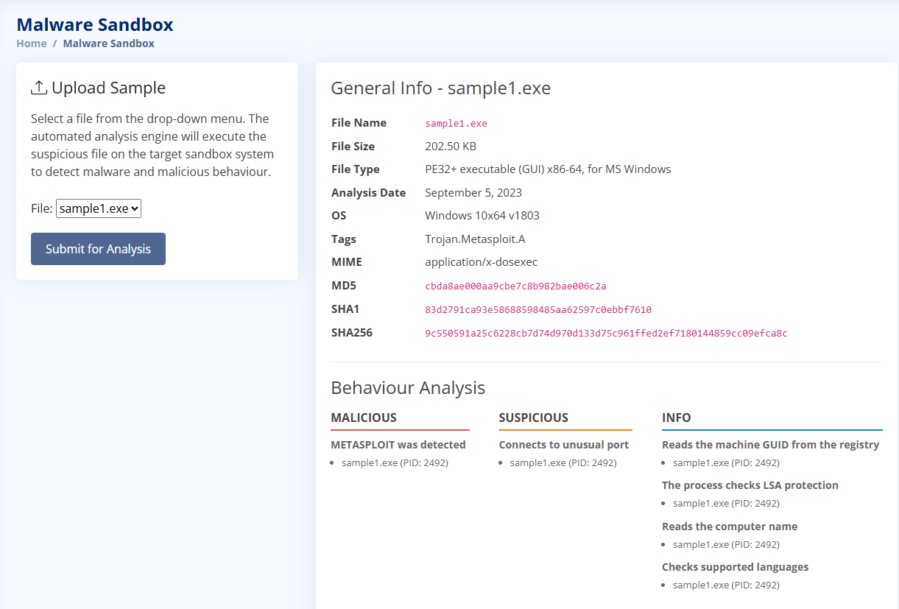

I copied the hash and submitted it to the hash blocklist, which gave me the first flag and the second sample.

This corresponds to the first level of the Pyramid of Pain: **hash values**, which are very easy for attackers to change.

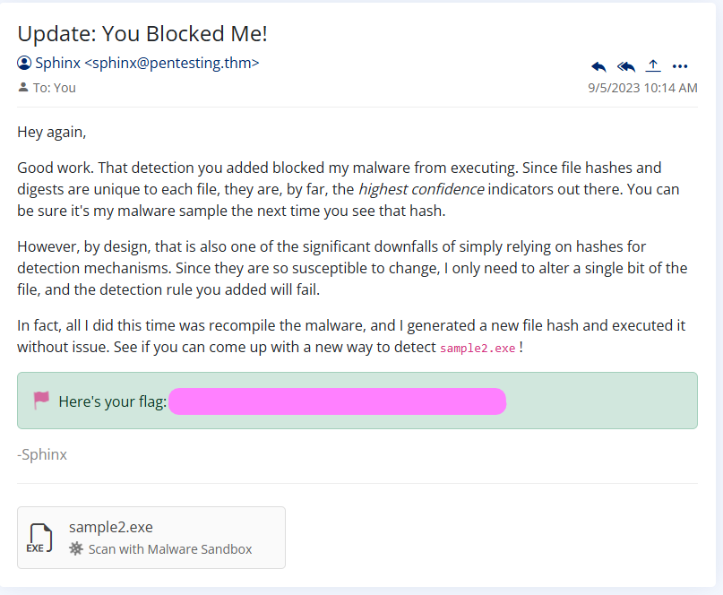

---

## sample2.exe

I analyzed the second sample in the malware sandbox. This time, I observed network activity — the malware was making a GET request to a specific URL.

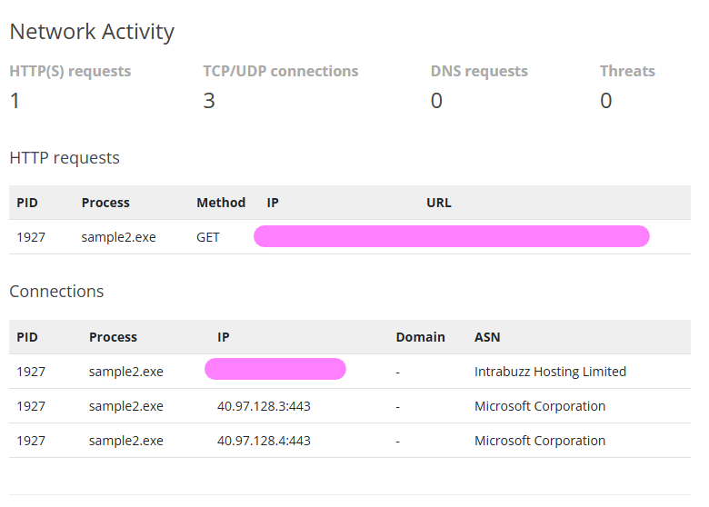

I blocked the IP address using the firewall manager and obtained the second flag and the next sample.

This corresponds to the second level: **IP addresses** — still easy to change, but slightly more effort than hashes.

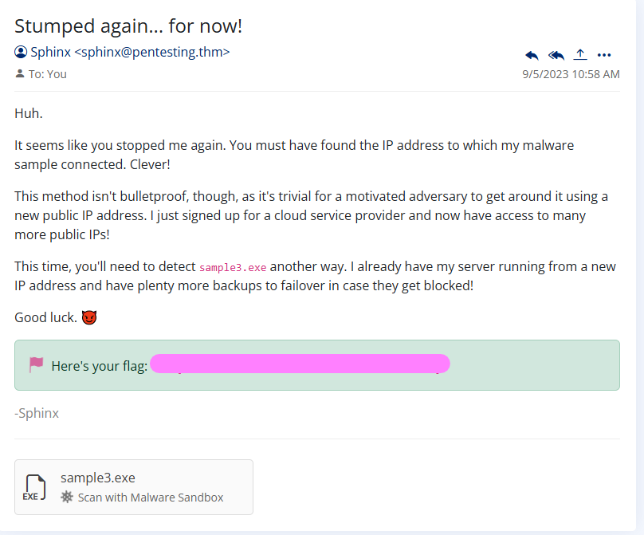

---

## sample3.exe

After analyzing the third sample, I found a DNS request in the network activity.

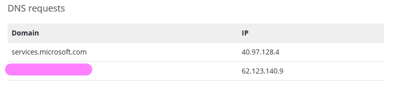

I used the DNS rule manager to block the domain and received the third flag.

This corresponds to **domain names** — still changeable, but attackers need more effort (e.g., registering new domains).

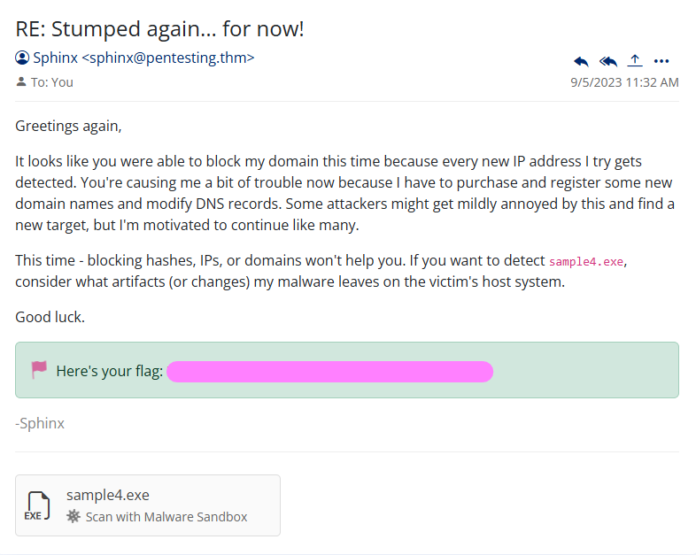

---

## sample4.exe

The fourth sample revealed suspicious registry activity in the sandbox.

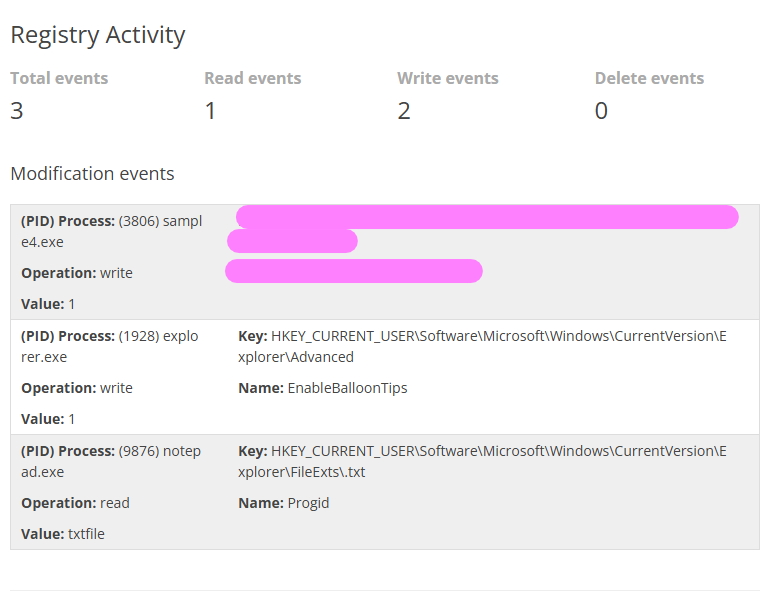

I used the Sigma rule builder to detect this behavior and obtained the fourth flag along with a log file.

This corresponds to **host artifacts**, which are harder for attackers to change without modifying their behavior.

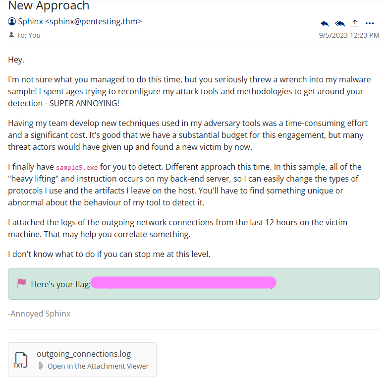

---

## sample5.exe

I first analyzed the log file, which showed network connections over the last 12 hours.

I noticed repeated 97-byte packets over port 443, which suggested possible C2 beaconing. After analyzing the sample in the sandbox, this behavior was confirmed.

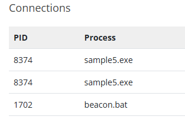

I created a Sigma rule based on:

- payload size (97 bytes)
- regular interval (~30 minutes)

I used "any" for IP and port since the attacker had evolved.

This gave me the fifth flag, the next sample, and another log file.

This corresponds to:

- **network artifacts**
- **tools**

At this point, it becomes much harder for the attacker to adapt.

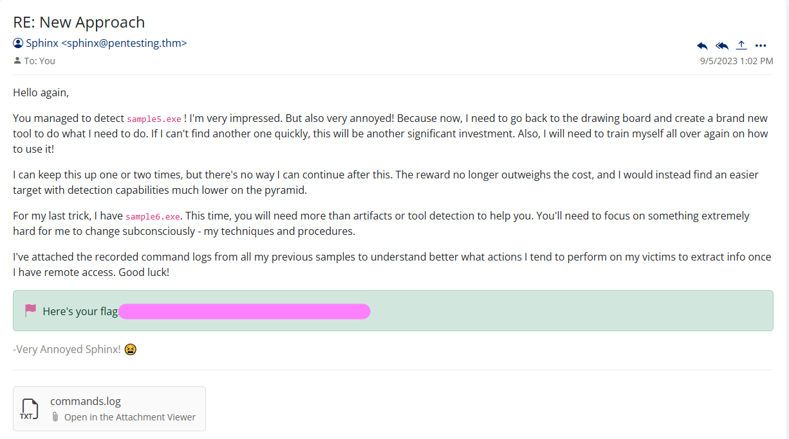

---

## sample6.exe

I analyzed the final sample and the provided log file.

The logs contained commands used by the attacker to exfiltrate data.

I created another Sigma rule to detect and stop this behavior, which gave me the final flag.

This corresponds to **TTPs (Tactics, Techniques, and Procedures)** — the highest level of the Pyramid of Pain and the hardest for attackers to change.

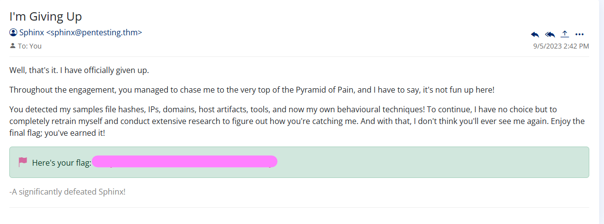

---

## Final thoughts

- Lower levels (hashes, IPs) are easy to block but also easy to bypass
- Higher levels (behavior, TTPs) are much more effective for long-term defense
- Using Sigma rules helped move from simple blocking to behavioral detection

This exercise showed how focusing on higher levels of the Pyramid of Pain makes detection stronger and increases the attacker's effort significantly.
